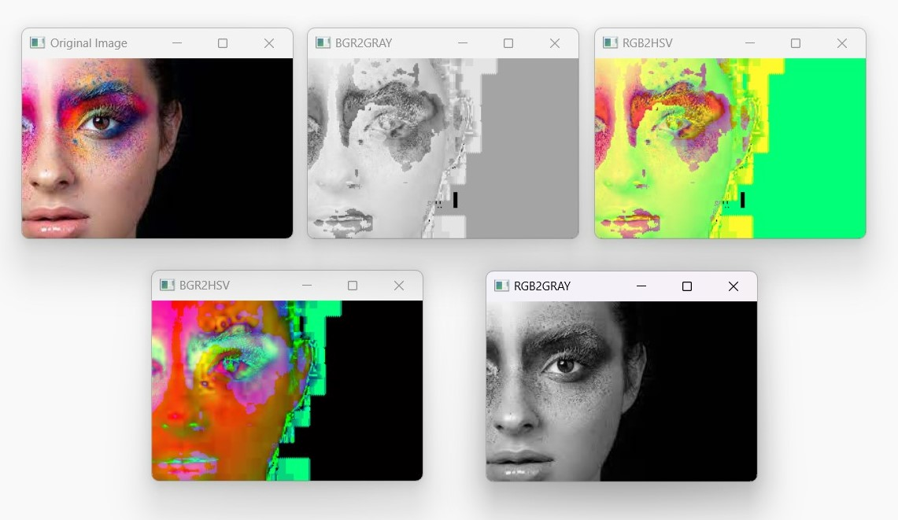
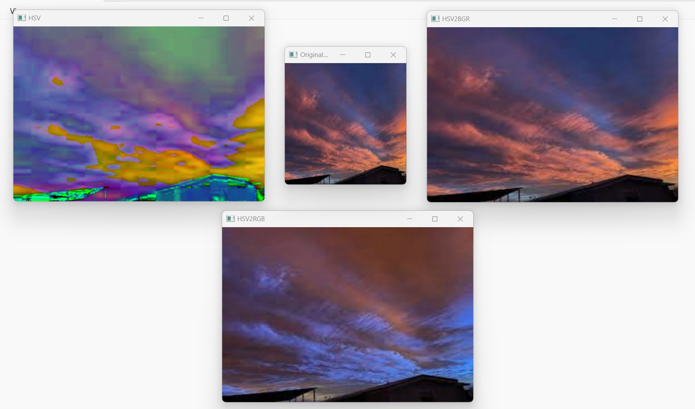
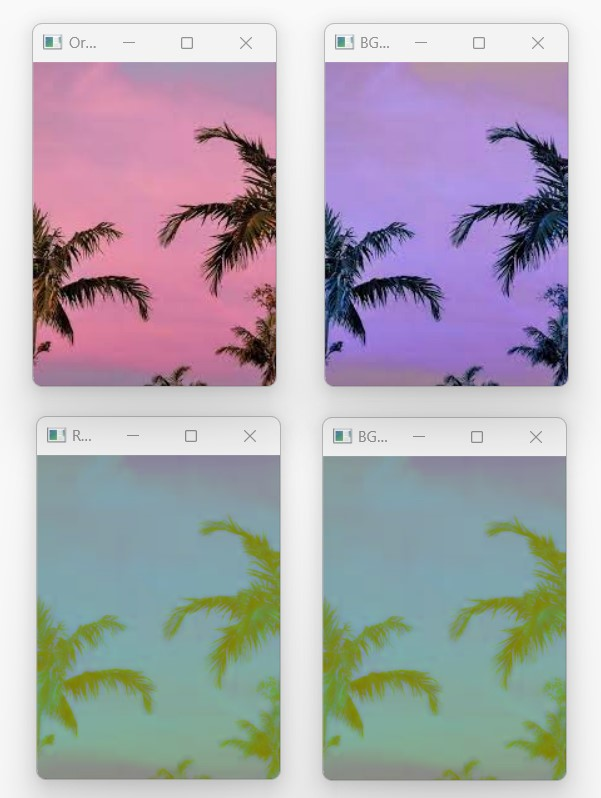
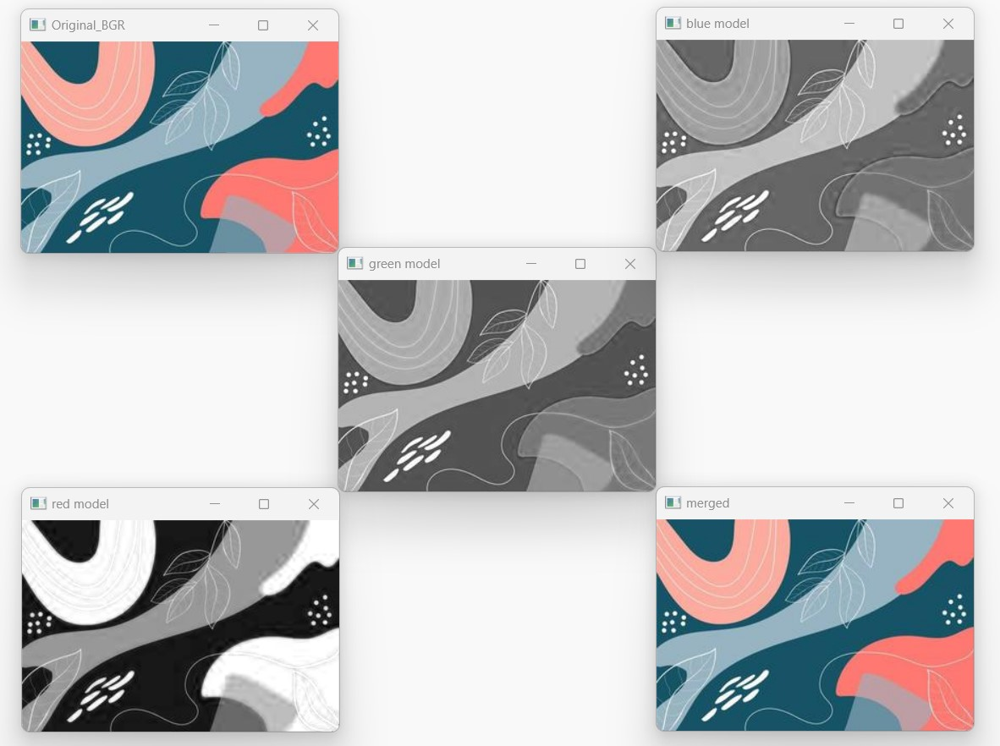
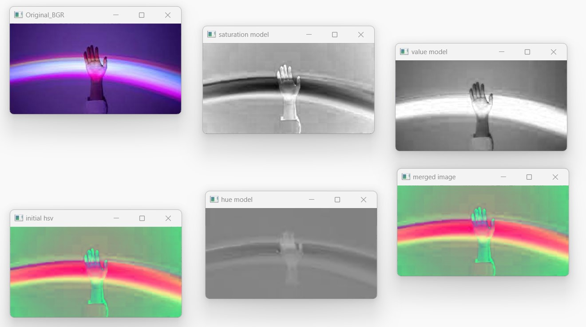

# COLOR_CONVERSIONS_OF-IMAGE

## AIM
To perform the color conversion between RGB, BGR, HSV, and YCbCr color models.
</br>
## Software Required:
Anaconda - Python 3.7
</br>
</br>
## Algorithm:
</br>
### Step1:
</br>
Import cv2 library and upload the image or capture an image.
</br>
### Step2:
</br>
Read the saved image using cv2.imread().
</br>
### Step3:
</br>
Convert the image into the given color transformation using cv2.cvtColor().<br>
</br>
### Step4:
</br>
Split and merge the image using cv2.split() and cv2.merge()<br>
</br>
### Step5:
</br>
Output the image using cv2.imshow()
</br>
### Step6:
</br>
Flip the original image horizontally and display it.
Flip the original image vertically and display it.
</br>
### Step7:
Save the final modified image to your local directory.
<br>

</br>
##### Program:
### Developed By: KERSOAN P
### Register Number: 212221230050 
</br>
</br>

```python

# i) Convert BGR and RGB to HSV and GRAY

import cv2
myimage = cv2.imread('d1output.jpg')
cv2.imshow('Original Image',myimage)

#BGR2HSV
myimage = cv2.cvtColor(myimage, cv2.COLOR_BGR2HSV)
cv2.imshow('BGR2HSV',myimage)

#RGB2HSV
myimage = cv2.cvtColor(myimage, cv2.COLOR_RGB2HSV)
cv2.imshow('RGB2HSV',myimage)

#BGR2Gray
myimage = cv2.cvtColor(myimage, cv2.COLOR_BGR2GRAY)
cv2.imshow('BGR2GRAY', myimage)

#RGB2Gray
grayimage = cv2.cvtColor(myimage, cv2.COLOR_RGB2GRAY)
cv2.imshow('RGB2GRAY', grayimage)
cv2.waitKey(0) 
cv2.destroyAllWindows()

# ii)Convert HSV to RGB and BGR

myimage = cv2.imread("d2output.jpg")
image= cv2.resize(myimage, (465,324))

#BGR2HSV
hsv = cv2.cvtColor(image, cv2.COLOR_BGR2HSV)
cv2.imshow("HSV", hsv)
hsv_rgb = cv2.cvtColor(hsv, cv2.COLOR_HSV2RGB)
cv2.imshow("HSV2RGB", hsv_rgb)
hsv_bgr = cv2.cvtColor(hsv, cv2.COLOR_HSV2BGR)
cv2.imshow("HSV2BGR", hsv_bgr)
cv2.waitKey(0)
cv2.destroyAllWindows()


# iii)Convert RGB and BGR to YCrCb

import cv2
myimage = cv2.imread("d3output.jpg")
cv2.imshow("Original_BGR", myimage)
img_ycrcb = cv2.cvtColor(myimage , cv2.COLOR_BGR2YCrCb)
cv2.imshow("BGR2YCrCb", img_ycrcb)
img_rgb = cv2.cvtColor(myimage, cv2.COLOR_BGR2RGB)
cv2.imshow("BGR2RGB", img_rgb)
img_bgr_y = cv2.cvtColor(img_rgb, cv2.COLOR_RGB2YCrCb)
cv2.imshow("RGB2YCrCb", img_bgr_y)
cv2.waitKey(0)
cv2.destroyAllWindows()


# iv)Split and Merge RGB Image

myimage = cv2.imread("d4output.jpg")
b,g,r = cv2.split(myimage)
cv2.imshow("red model", r)
cv2.imshow("green model", g)
cv2.imshow("blue model ", b)
merger = cv2.merge([b,g,r])
cv2.imshow("merged", merger )
cv2.waitKey(0)
cv2.destroyAllWindows()


# v) Split and merge HSV Image

import cv2
myimage = cv2.imread("d5output.jpg")
cv2.imshow("Original_BGR", myimage)
hsv = cv2.cvtColor(myimage , cv2.COLOR_BGR2HSV)
cv2.imshow("initial hsv ", hsv)
h,s,v = cv2.split(hsv)
cv2.imshow("hue model", h)
cv2.imshow("saturation model", s)
cv2.imshow("value model ", v)
merger = cv2.merge([h,s,v])
cv2.imshow("merged image", merger )
cv2.waitKey(0)
cv2.destroyAllWindows()


```
## Output:
### i) BGR and RGB to HSV and GRAY



<br>

### ii) HSV to RGB and BGR


<br> 

### iii) RGB and BGR to YCrCb



### iv) Split and merge RGB Image


<br>

### v) Split and merge HSV Image


<br>


## Result:
Thus the images are read, displayed, and written ,and color conversion was performed  successfully using the python program.
